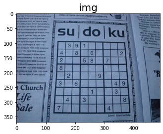
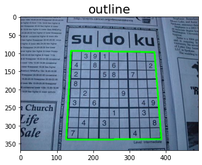
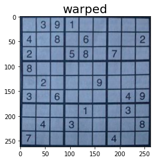

# sudoku
I have built a program to identify a sudoku grid from almost any background.

Here is an example of a raw image:

After some preprocessing using opencv we first find the outline of the sudoku grid with edge detection which gives us this:

We can then easily transform it and zoom in

to display the grid only.

We then divide the grid in its 81 cells and look at each cell to find out if it has a number in it or not. 
If it does, we use a conv-net model that we trained on the mnist dataset as well as some generated digits from given sudokus to identify the numbers inside the grid.
We can now convert the grid into a numpy array.

- - - - - - - - - - - - - 
| 0 3 9 | 1 0 0 | 0 0 0 |
| 4 0 8 | 0 6 0 | 0 0 2 |
| 2 0 0 | 5 8 0 | 7 0 0 |
- - - - - - - - - - - - - 
| 8 0 0 | 0 0 0 | 0 0 0 |
| 0 2 0 | 0 0 9 | 0 0 0 |
| 3 0 6 | 0 0 0 | 0 4 9 |
- - - - - - - - - - - - - 
| 0 0 0 | 0 1 0 | 0 3 0 |
| 0 4 0 | 3 0 0 | 0 0 8 |
| 7 0 0 | 0 0 0 | 4 0 0 |
- - - - - - - - - - - - - 

In the end we use backtracking to solve the sudoku

Alternatively you can use py-sudoku to solve it

In future updates I will use a dataset different to mnist to train the algorithm. It still has some issues with a few of the numbers

